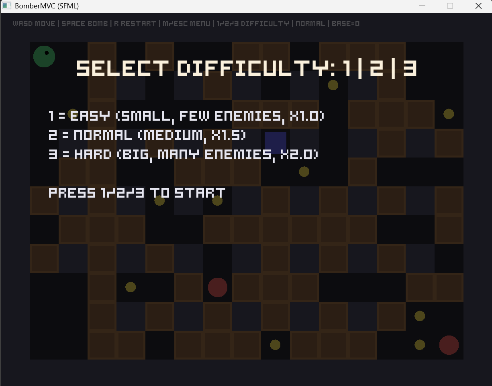
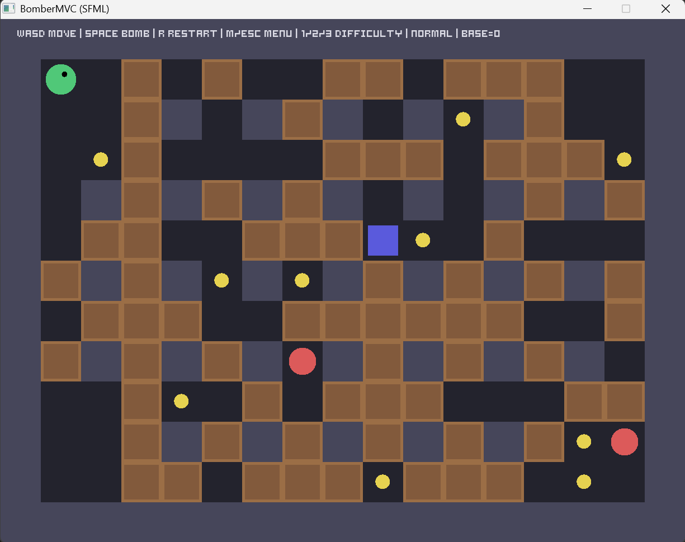
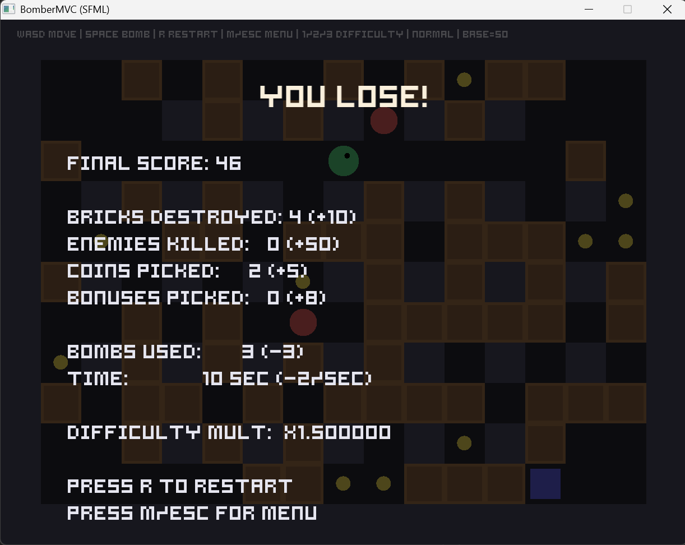

## Сборка
```
rm -rf build
cmake -S . -B build -G "MinGW Makefiles" -DCMAKE_BUILD_TYPE=Release
cmake --build build
```
## Запуск
```
./build/BomberMVC.exe
```
## Menu



## Gameplay




## Lose Screen

